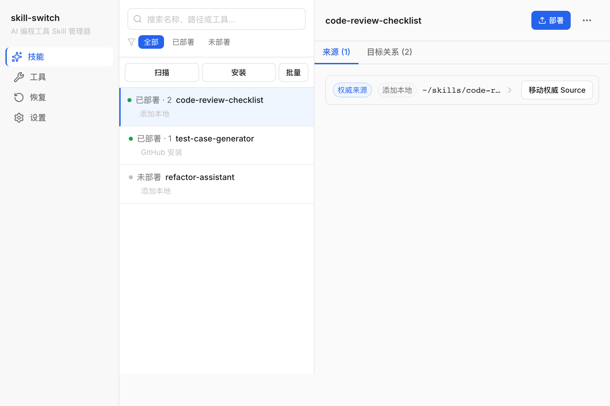

# skill-switch

> **在一个地方安装、整理并部署你的 AI 编程 Skills。**
>
> *Manage one canonical Skill library and deploy it safely to every AI coding tool you use.*

skill-switch 是一个本地优先的桌面应用，为同时使用多个 AI 编程工具的开发者维护一个权威 Skill 源码库，并把选中的 Skill 安全部署到各工具目录。所有 Skill 来源、部署关系和恢复证据都在本机登记，应用不要求账号、不收集遥测、不运行后台服务。

> 截图来自 v1.0.0 RC 构建，使用虚构示例数据（不包含真实用户名、绝对路径或 Token）。

## 支持工具

skill-switch 内置以下工具的发现目录（可在「工具」中启用 / 禁用或自定义路径）：

- **TRAE**（`~/.trae-cn/skills`、`~/.trae/skills`）
- **Codex**（`~/.codex/skills`）
- **Claude Code**（`~/.claude/skills`）
- **Agents**（`~/.agents/skills`）
- **Gemini CLI**（`~/.gemini/skills`）

## 下载与指南

- **下载安装包**：前往 [GitHub Releases](https://github.com/xijuangu/skill-switch/releases) 获取各平台安装产物。
- **中文用户指南**：[docs/user-guide.md](docs/user-guide.md) 覆盖安装、整理、接管、部署、取消部署、批量操作与恢复。

发布版本支持以下安装产物（详见各 Release 说明）：

| 平台 | 产物 |
| --- | --- |
| macOS | `.dmg`（优先 Apple Silicon） |
| Windows | x64 NSIS 安装包（`Setup.exe`） |
| Linux | x64 AppImage，并尽量一并发布 `.deb` |

> ⚠️ **未签名与未公证**：skill-switch 没有商业代码签名和公证证书。首次打开时 macOS Gatekeeper 或 Windows SmartScreen 可能提示「无法验证开发者」或「已保护你的电脑」。这来自未签名状态，不代表安装失败。
>
> - **macOS**：在「访达」中右键点击应用 → 选择「打开」→ 在弹窗中确认「打开」；或在「系统设置 → 隐私与安全性」中点「仍要打开」。
> - **Windows**：在 SmartScreen 弹窗中选「更多信息」→「仍要运行」。
>
> 详见 [SECURITY.md](SECURITY.md)。

## 本地优先、隐私与确认承诺

- **无账号、无遥测、无后台服务**：应用不调用任何登录或云同步接口，不在后台常驻，也不上报任何使用数据。
- **主动联网边界**：应用只在你主动「从 GitHub 安装 Skill」时通过 `git` 拉取公开仓库内容，或在你点击「检查更新」时读取 GitHub Latest Release 元数据。其他操作（扫描、整理、部署、取消部署、批量操作、备份与恢复）完全在本机完成，不会把你的 Skill 内容或本机路径上传到任何服务器。
- **一次性确认**：覆盖外部内容、降级部署模式（如 `symlink` → `copy`）和批量变更都需要你在执行前明确确认；renderer 只提交语义 ID，绝不直接提交文件系统路径。
- **可恢复**：整理移除的来源默认进入可恢复的来源归档区；部署中断会保留现场和备份，由你选择恢复方案。

## 核心价值

- **一个权威版本**：每个已整理 Skill 在 `~/.skill-switch/skills` 中只有一个权威 Source，所有工具的部署都从它派生。
- **多工具部署**：安装或部署时可在同一个多工具矩阵中连续把 Skill 部署到 TRAE、Codex、Claude Code、Agents、Gemini CLI，默认使用 `symlink` 共享同一份权威内容。
- **安全的批量操作**：技能页支持批量部署、取消部署和从注册表移除；工具页的部署关系支持批量取消部署、解除登记，以及把外部 Skill 批量纳入管理。
- **外部订阅只读**：扫描到的其他程序建立的链接在显式接管前不会被删除或改写；从注册表移除会先预检全部关系，存在未接管关系时拒绝执行。
- **最小侵入**：卸载 skill-switch 不会破坏已部署到工具目录的 Skill；`symlink` / `junction` 仍指向权威源码库。

## 三步开始

1. **启用工具并扫描**：在「工具」中确认要管理的工具目录，回到「技能」页点「扫描」。
2. **整理成权威来源**：把候选来源「整理」到权威源码库；同名不同内容需显式选择权威版本。
3. **部署到工具**：选中 Skill 点「部署」，在多工具矩阵中选择目标并确认（默认 `symlink`）。安装新 Skill 后会直接进入部署步骤。

更多操作（接管外部订阅、批量操作、漂移与恢复）见[中文用户指南](docs/user-guide.md)。

## 平台支持

skill-switch 在 macOS、Windows 和 Linux 上运行。开发者工具以桌面应用形式分发，不依赖系统包管理器。当前首发最小资产合同为：一个 macOS DMG、一个 Windows x64 NSIS 安装包、至少一个 Linux x64 安装包（AppImage 优先）。macOS Intel 独立 DMG、Windows ARM、Linux ARM 暂不在首发范围内。

## 贡献与开发

- 贡献流程见 [CONTRIBUTING.md](CONTRIBUTING.md)。
- 架构、领域模型、内部流程与历史 issue 索引见 [docs/development.md](docs/development.md)（已从本 README 移出，避免淹没用户主路径）。
- 领域语言定义见 [CONTEXT.md](CONTEXT.md)。

## 许可证与第三方通知

- 本仓库代码以 MIT 协议发布，详见 [LICENSE](LICENSE)。
- 实际发布依赖的第三方许可证与 Inter 字体的 SIL Open Font License 1.1 通知见 [docs/THIRD_PARTY_LICENSES.md](docs/THIRD_PARTY_LICENSES.md)。
- 安全漏洞报告方式见 [SECURITY.md](SECURITY.md)。

## English summary

skill-switch is a local-first desktop app for developers who use several AI coding tools at once. It maintains one canonical Skill library at `~/.skill-switch/skills` and safely deploys the chosen skills to each tool's discovery directory (TRAE, Codex, Claude Code, Agents, Gemini CLI). There are no accounts, no telemetry and no background services: the app only reaches the network when you actively install a skill from a public GitHub repository. Releases ship unsigned and un-notarized, so macOS Gatekeeper or Windows SmartScreen may prompt you to manually approve the first launch — see [SECURITY.md](SECURITY.md) for the exact steps. See the [user guide](docs/user-guide.md) for install, organize, adopt, deploy, undeploy, bulk and recovery flows.
